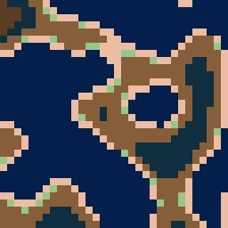
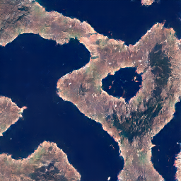

# Pix2Sat

[_From Pixel Art to Satellite Images: Enhancing Generation of Terrain using Generative Adversarial Nets_](pix2sat.pdf)

## Overview
Pix2Sat’s generation process can be summarized in several steps, combining procedural generation and GAN-based translation:

- **Heightmap Generation**: It begins by generating a random height map (32×32 values) using procedural noise (e.g. Perlin, Simplex)​. This height map represents the basic terrain elevation layout, with values ranging from 0 (low) to 1 (high).

- **Pixel Art Creation**: The 32×32 height matrix is converted into a pixel art landscape. Each value is mapped to one of 7 discrete colors corresponding to terrain types (e.g. dark blue for water, green for forest, white for snow)​. The height range is divided into intervals – each interval assigned a color from the palette in order of elevation​. This produces a 32×32 color grid, which is then upscaled by replacing each small cell with an 8×8 block of the same color, yielding a 256×256 pixel art image with chunky “pixels”​. Essentially, a single colored block in the pixel art represents a region of terrain (e.g. a patch of ocean, sand, forest, etc.).

- **GAN Translation**: The pixel art image is fed into the Generator network of a GAN, which is trained to transform this simplified map into a realistic terrain image of the same size​. The Generator outputs a 256×256 RGB image that mimics the appearance of real satellite photos while preserving the layout of the input (water areas remain water, forests remain forests, etc.). The result is a detailed image with textures like waves, trees, or mountains, corresponding to the colored regions in the input.

- **User Control (Editing)**: An optional step allows user intervention before the GAN generates the final image. Because the pixel art acts as an intermediate representation, a user can manually edit the pixel art map (using the same 7-color palette) to adjust the terrain placement or features​. For example, one could draw additional green areas (forest) or extend a blue region (water) in the pixel image. This edited pixel art can then be passed into the model to produce a modified realistic image. This provides an intuitive way to control the GAN’s output by tweaking the color map, offering a high level of customization in the terrain generation process​

## Sample
|    |    |
| :---: | :---: |
|  Input Pixel Art  |  Output Satellite-Like Image  |